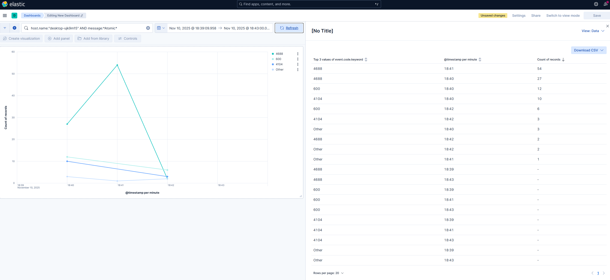
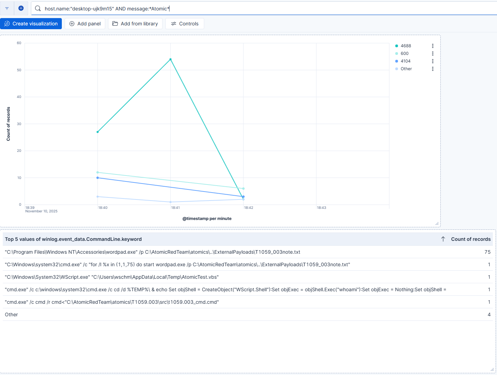
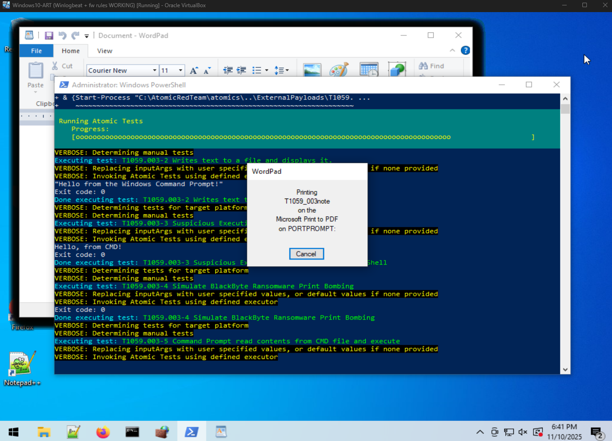
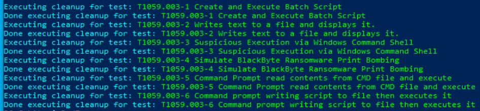

# MYRMIDON Detection Lab: Atomic Red Team → ELK Pipeline

Production-grade threat simulation and detection pipeline using Atomic Red Team (ART) attacks ingested into ELK Stack. Demonstrates end-to-end: Attack execution → Sigma-inspired detection → Kibana visualization.

Built for enterprise SOCs: Mirrors CrowdStrike/Expel triage workflows with live T1059.003 (Command and Scripting Interpreter: PowerShell) simulation.

## Quick Demo Flow
1. **Execute Attack**: On Windows VM — `Invoke-AtomicTest T1059.003 -TestNumbers 1` (cmd.exe lateral movement sim).
2. **Ingest Logs**: Beats to Logstash → Elasticsearch indexing.
3. **Detect & Visualize**: Kibana dashboard auto-updates with alerts, timelines, and MITRE ATT&CK mapping.

### Screenshots

## Import My Kibana Dashboard
1. Download: [malicious-executions-dashboard.ndjson](kibana/malicious-executions-dashboard.ndjson)
2. In Kibana: Stack Management → Saved Objects → Import → Upload → Check "Include related objects" → Import.
3. Assumes index pattern: `logs-*` (tweak if needed).

## Secure Auth Setup (ES 9.0.1)
- Superuser token: `elasticsearch-service-tokens.bat create elastic/kibana kibana-token`.
- kibana.yml: `elasticsearch.serviceAccountToken: [token]` — No login screens, direct to dashboards.
- Green cluster: Replicas=0 + single-node for 100% health (`discovery.type: single-node`).
- Live Demo (LAN: 192.168.1.75): http://192.168.1.75:5601 — Token auto-auth; run ART, watch spikes.

## Tech Stack
- **Atomic Red Team**: MITRE ATT&CK sims (T1059.003 tested).
- **ELK Stack**: ES 9.0.1 (green single-node), Kibana (token auth), Logstash/Beats for ingestion.
- **Detections**: 400+ Sigma rules incoming (top Windows process_creation for execution tactics).
- **Playbooks**: IR guides for top alerts (T1059.003: Triage to remediation in 20 mins).

Full setup scripts and playbooks in progress.

[Live Demo (LAN: 192.168.1.75 | Token-Auth: Service Account)](http://192.168.1.75:5601) — ES 9.0.1 secure token; no superuser.
