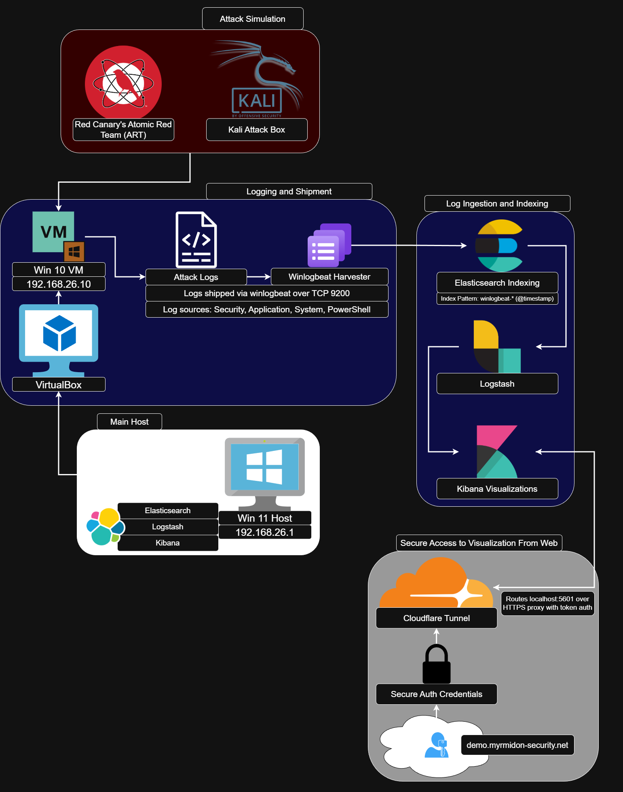
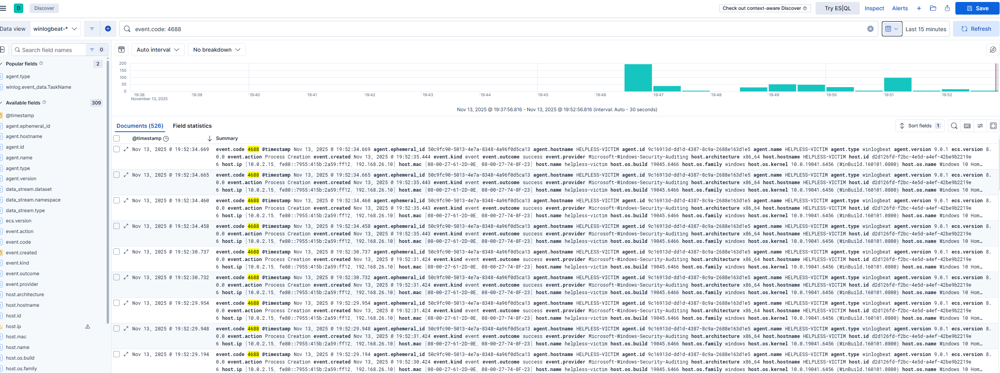
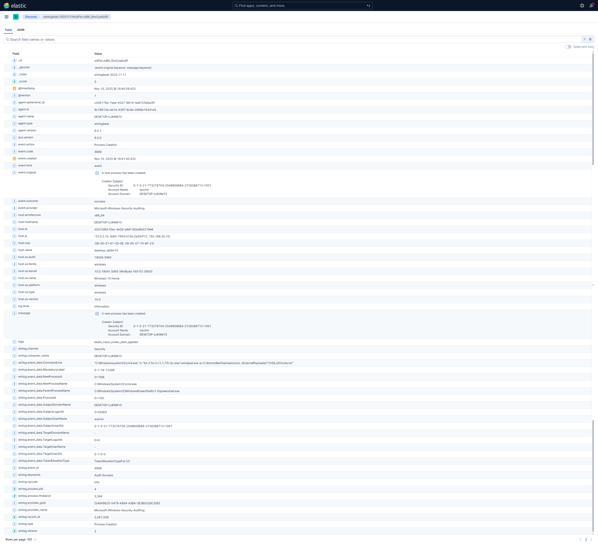
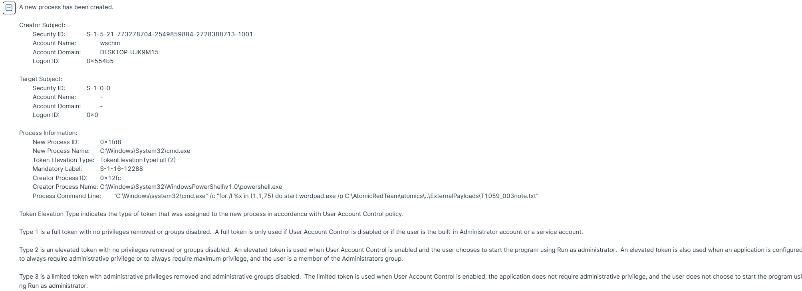
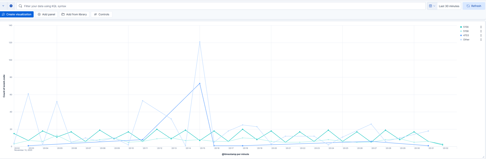
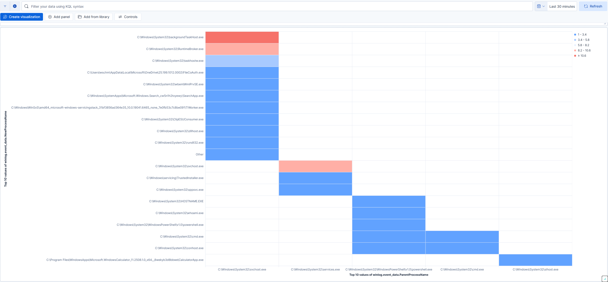
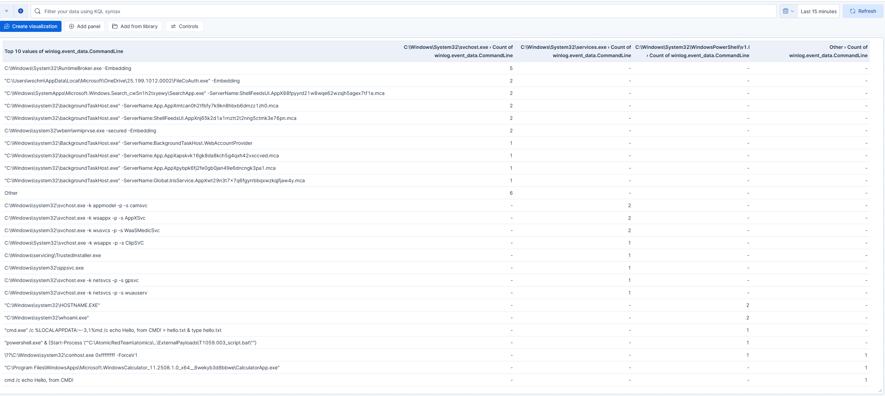
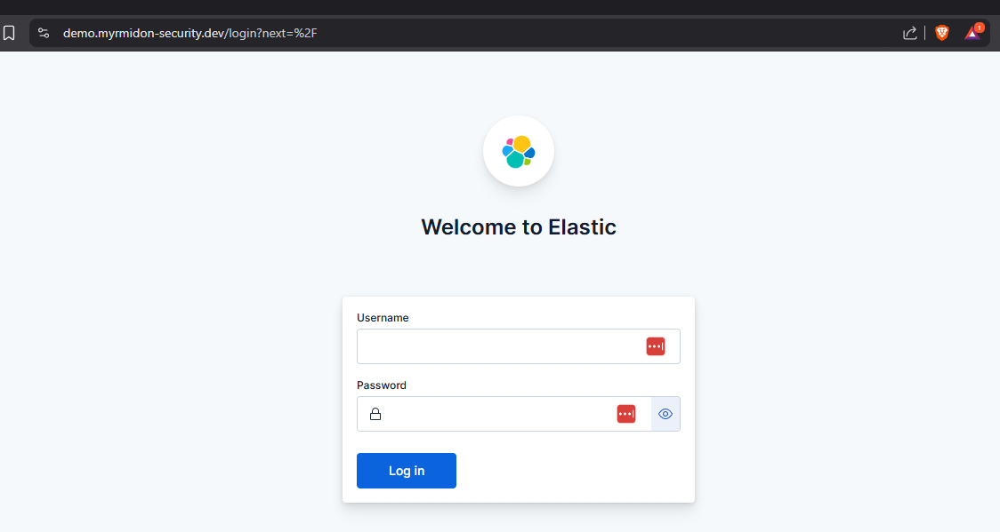
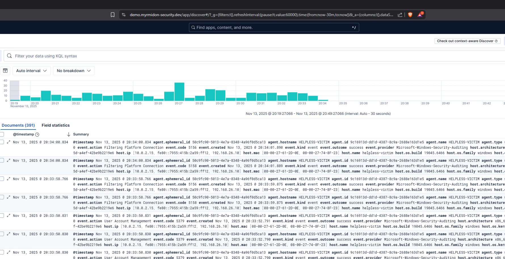

# MYRMIDON Detection Lab: Atomic Red Team → ELK Pipeline

Production-grade threat simulation and detection pipeline using simulated attacks ingested into ELK Stack. Demonstrates end-to-end: Attack execution → Sigma-inspired detection → Kibana visualization.

Built for enterprise SOCs: Mirrors CrowdStrike/Expel triage workflows with live simulation of attacks from Red Canary's Atomic Red Team (ART) and an independent Kali attack box.

For a live demo, DM me on LinkedIn and we'll get you set up with credentials to access and see log generation in real time.

## Quick Demo Flow
1. **Execute Attack**: On Windows VM "Invoke-AtomicTest T(Insert MITRE TTP).
2. **Ingest Logs**: Beats to Logstash → Elasticsearch indexing.
3. **Detect & Visualize**: Kibana dashboard auto-updates with alerts, timelines, and MITRE ATT&CK mapping.

### Screenshots

## Import My Kibana Dashboard
1. Download: [malicious-executions-dashboard.ndjson](kibana/processes_and_executions_dashboard.ndjson)
2. In Kibana: Stack Management → Saved Objects → Import → Upload → Check "Include related objects" → Import.

## Secure Auth Setup (ES 9.0.1)
- Service token: `elasticsearch-service-tokens.bat create elastic/kibana kibana-token`.
- kibana.yml: `elasticsearch.serviceAccountToken: [token]` — No logins, direct to enhanced dashboard (multi-event lines, parent-process heat).
- Green cluster: Replicas=0 + single-node (`discovery.type: single-node`) for 100% health.
- Web Accessible: Cloudflare Tunnel (demo.myrmidon-security.dev) — Zero ports, HTTPS, WAF; view events from anywhere.
- Live Demo: Available upon request, please DM me on LinkedIn. We'll set up credentials so you can watch log spikes in real time as attacks are run.

## Tech Stack
- **Atomic Red Team**: Attack simulations based on the MITRE ATT&CK framework, ability to execute specific TTPs
- **ELK Stack**: ES 9.0.1 (green single-node), Kibana (token auth, enhanced dashboard: Timeline spikes, process table, etc), Sysmon for log enrichment, Winlogbeat for Windows Security log shipment.
- **Sigma Rules**: Query conversions for easy detection of TTPs in log search.
